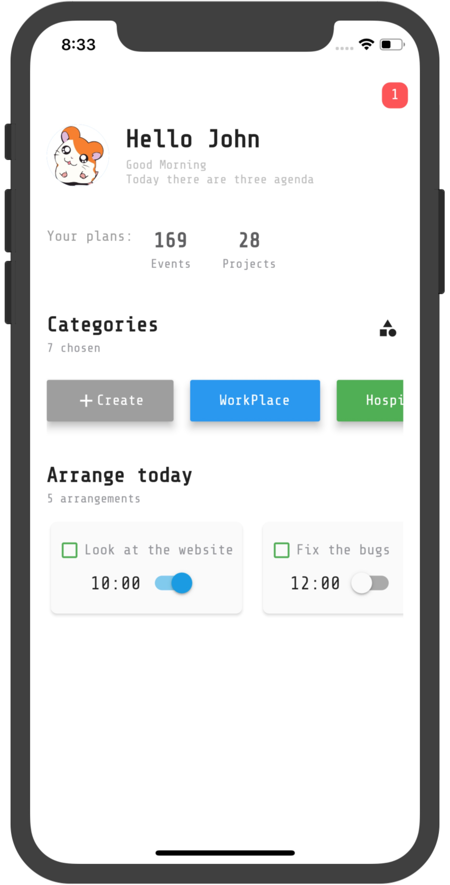

## 简介

日程软件，设计源自 https:&#x2F;&#x2F;dribbble.com&#x2F;shots&#x2F;5816541-Schedule-industry

## 效果




## Getting Started

This project is a starting point for a Flutter application.

A few resources to get you started if this is your first Flutter project:

- [Lab: Write your first Flutter app](https://flutter.io/docs/get-started/codelab)
- [Cookbook: Useful Flutter samples](https://flutter.io/docs/cookbook)

For help getting started with Flutter, view our 
[online documentation](https://flutter.io/docs), which offers tutorials, 
samples, guidance on mobile development, and a full API reference.


## 知识点

`IconButton` 或者其他 `Button` 遵循 `Material Design` 设计规范，有最小的尺寸，目的是为用户提供更好的交互体验，但在项目中为了实现 UI 的效果不得不对尺寸进行调整。
目前使用了以下几种方式

- Container + Icon，即自定义效果，可以准确的控制组件的大小

```dart
Container(
    margin: EdgeInsets.all(8),
    padding: EdgeInsets.all(0),
    constraints: BoxConstraints(
      minWidth: 30,
      minHeight: 30,
      maxHeight: 30,
      maxWidth: 30,
    ),
    child: Icon(
      iconData,
      size: 20,
    ),
  ),
```

- ConstrainedBox，把按钮放到一个有约束的 box 下，强制限制其尺寸。**推荐使用此方式，可以参考界面中的 Categories 右边的icon以及Switch**

```dart
ConstrainedBox(
    constraints: BoxConstraints(
      minWidth: 30,
      minHeight: 30,
      maxHeight: 30,
      maxWidth: 30,
    ),
    child: IconButton(
      padding: EdgeInsets.all(0),
      icon: Icon(iconData, size: 20),
      onPressed: onPressed == null ? () {} : onPressed,
    ),
  ),
```

## 感谢

- Dribble 设计 [Schedule Industry](https://dribbble.com/shots/5816541-Schedule-industry)
- Google Fonts [Share Tech Mono](https://fonts.google.com/specimen/Share+Tech+Mono/)

## 参考

